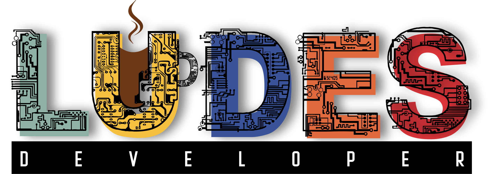

# **Juju Charmed Kubernetes (Using Calico) on AWS**
<p align="center">

</p>

### **Requirements**
1. [AWS CLI installed](https://docs.aws.amazon.com/cli/latest/userguide/getting-started-install.html)
```
sudo apt install unzip
```
```
curl "https://awscli.amazonaws.com/awscli-exe-linux-x86_64.zip" -o "awscliv2.zip"
unzip awscliv2.zip
sudo ./aws/install
```
2. [Configure AWS CLI](https://docs.aws.amazon.com/cli/latest/userguide/cli-configure-quickstart.html#cli-configure-quickstart-config)
```
aws configure
```
3. Kubectl installed
```
sudo snap install kubectl --classic
```
4. [Boto3 installed](https://boto3.amazonaws.com/v1/documentation/api/latest/guide/quickstart.html)
```
pip3 install boto3
```
5. Juju installed
```
sudo snap install juju --classic
```
### **How To**
1. Clone repo
```
git clone https://github.com/ludesdeveloper/juju-charmed-kubernetes.git
```
2. Change directory
```
cd juju-charmed-kubernetes
```
3. Bootstrap Controller
```
juju bootstrap aws aws-controller
```
4. Add k8s model
```
juju add-model k8s
```
5. Deploy Charmed Kubernetes with overlay
```
juju deploy charmed-kubernetes --overlay aws-overlay.yaml --trust --overlay calico-overlay.yaml
```
6. Watch process
```
watch -c juju status --color
```
> You can move to step 7 if ec2 already in 2/2 checks passed state
7. Disable source check destination on ec2(I use boto3 to do this)
```
python3 ec2_disable_source_check_destination.py 
```
8. Copy kubeconfig
```
juju scp kubernetes-master/0:config ~/.kube/config
```
9. Check kube system
```
kubectl get pods -n kube-system
```
10. If pod still crashing, get deployment below
```
kubectl get deployment -n kube-system
```
11. Restart all deployment in kube-system except for calico, i prepare script for this
```
./rollout_restart.sh
```
> Create ~/.kube folder if you don't have
### **Clean Up**
1. Destroy models
```
juju destroy-model k8s
```
> If takes to long, you can ctrl+c then force destroy with command below
2. Forced Destroy models
```
juju destroy-model k8s --timeout=0 --force
```
3. Destroy models default if needed
```
juju destroy-model default
```
3. Destroy controller
```
juju destroy-controller aws-controller
```
